# Test tags

An easy, reduced and visual way to describe the steps in the test scenarios.

**Example:**  

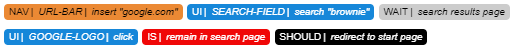

## Context

When creating an application, it is always convenient to test the possible actions of the user and make sure that our application works correctly in all its variants.

This testing process starts mainly with the definition of different cases or scenarios, the corresponding steps that a user would perform and the description of how the application is expected to react. If the behaviour of the application was not as expected during the execution of the tests, it describes the process in order to later compare how it happened and how it should be.

This description is the means of communication between developer and tester, as it helps them:

- define what the application should and should not do
- reproduce the scenarios several times and check that they work correctly
- get an overview of the status of the application and identify faults

## About this framework

Test-tag decomposes and groups the elements found in an application and establishes a tag for each element that allows it to be quickly identified.

These tags are in turn made up of 3 parts:
1. type
2. subject
3. predicate

The tags are in short a syntax minimalization that allows to write sentences / test cases in an abbreviated way.

## Areas

According to the elements that we find when visualizing a web in the browser, it is possible to create groups according to their characteristics and relationship with the user.

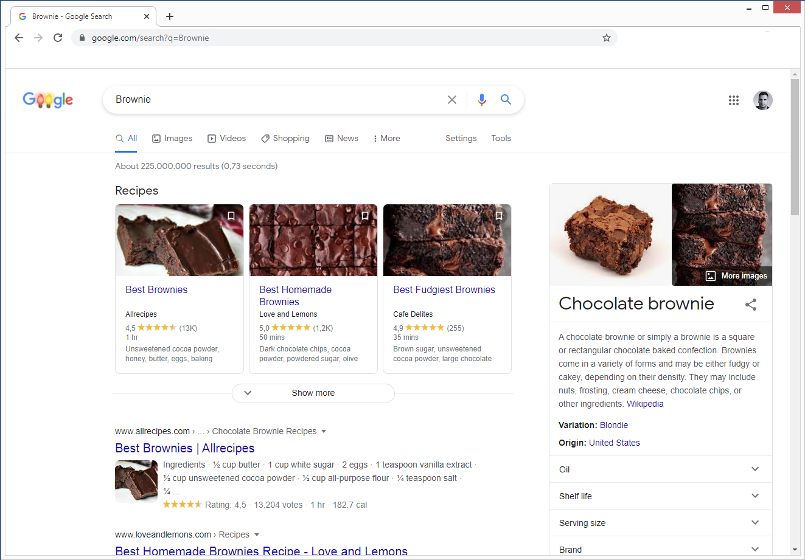

The main areas are:

### Navigation

Browser-specific navigation elements.

- Browser Back
- Reload
- Url + Manipulation
- Browser scroll
- History
  
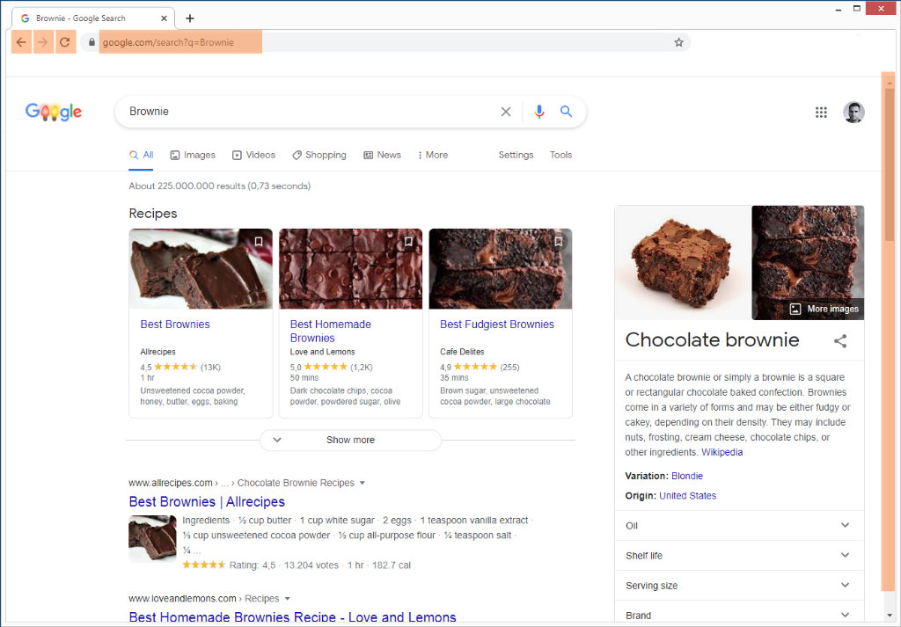

### Context

Entities saved in the browser or the application, not always directly visible.

- Cookies
- User
- Session
- Basket
  
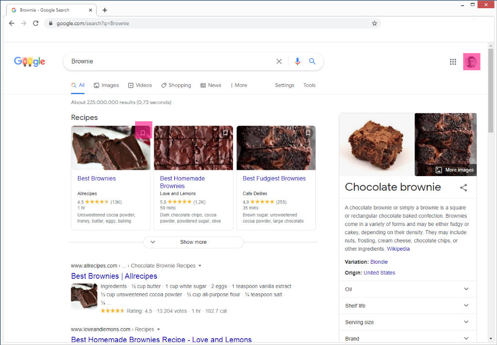

### User interaction

Elements with which the user can interact.

- click, hover
- scroll
- keyboard / mobile
  - enter
- links / buttons
- inputfelder
- clickable elementen:
  - images
  
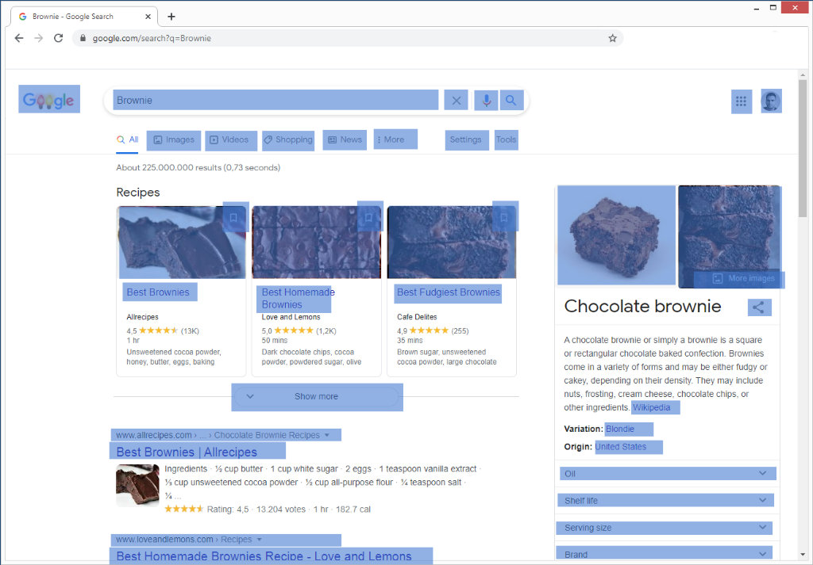

### Visual elements

All the relevant visual elements (not clickable)

- Text
- Icons
- Grouped elements
- ...
  
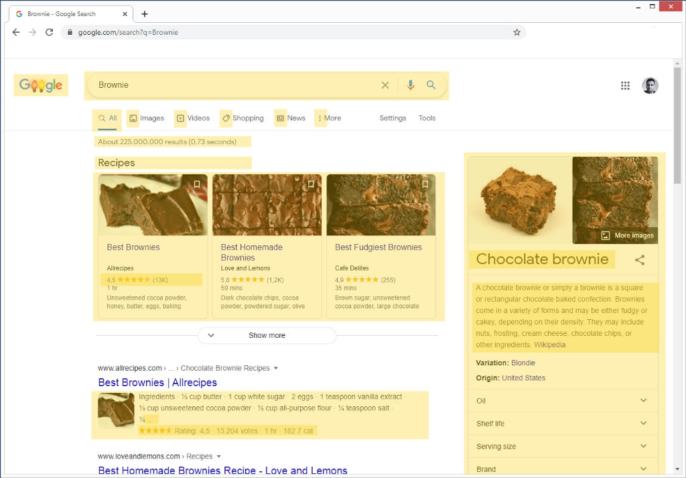

## Tags overview

### Navigation (NAV)

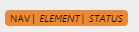

---
### Process (WAIT)

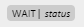

Describes a waiting process for tester/user
- redirects
- loading

---
### Context (CTX)

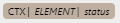

---
### User Interaction (UI)

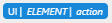

---
### Visual Elements (VIS)

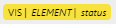

---
### Test Result (IS: error, ok )

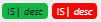

Describes the result status of the test

---
### Test Result (SHOULD)

Describes the expected status of the test

# Usage Examples

**Test case:**  
Redirect action in Google logo in the the "search-results" Page.

**Test tags:**

# Integration in your project

This method is only a convention with a reduced syntax. Adapt this syntax according to the tool you have available for your project.

- Wikis
- Readme
- Reports

## Conventions

### Tag colors palette
Define your custom palette if needed.  
Respects basic colours such as red and green and their association and meaning of success or error.

### Elements Ids
It is important to assign unique identifiers to the elements.
Define a convention for the name of the ids, which you may be able to apply to other parts of the project such as automated tests.

## List of elements

Define the main list of elements of your application and make it accessible to all stakeholders, so that they can easily copy and paste it to create test cases more quickly and uniformly.
It is impossible to create a list of absolutely all the elements of the project. It is important to define which ones are relevant for quality assurance.

## Inspiration an To-dos

1. Drag And Drop Tool, 
   block-based visual programming language like with https://scratch.mit.edu/
2. Puzzle test-cases definition
   1. Lego
   2. Post-Its
3. E2e tests creator tool from parsing test-tags

## Related links

### Tools
- https://scratch.mit.edu/

### Test standards
- https://www.iso.org/obp/ui/#iso:std:iso-iec-ieee:29119:-4:ed-1:v1:en

### Test automation

- https://docs.cypress.io/guides/references/best-practices.html#Selecting-Elements
- https://cucumber.io/docs/guides/overview/